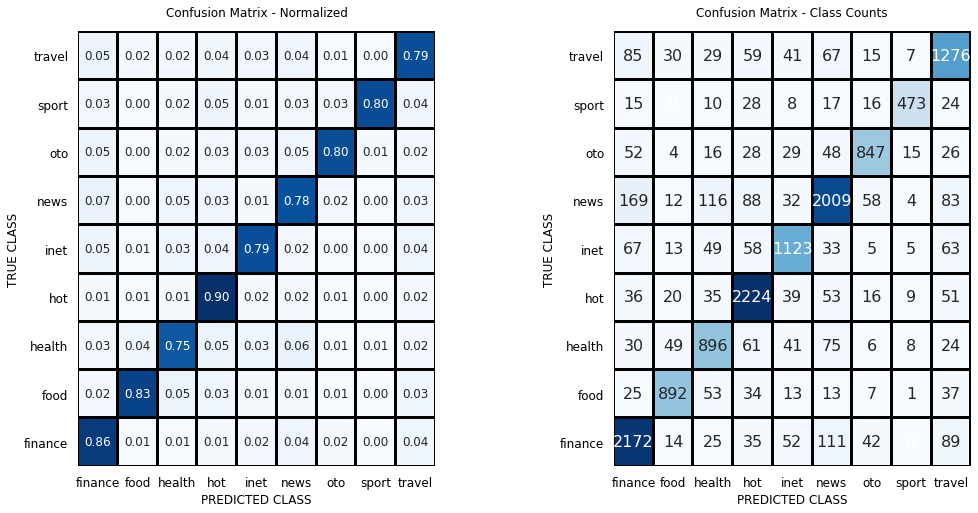

# Indonesia News Title Classification
## Project Intro/Objective
This project demonstrate a simple classification task of text data using some basic features (BoW and TF-IDF) and models (Naive Bayes & Logistic Regression). Through the process, this project also leverages some important concept in machine learning such as cross validation, confusion matrix, simple parameter tuning using randomized search, data preprocessing, and many more.
The final model of this project have the accuracy of 81 % with F1 score 81 % while tested on the test set.
Afterwards, this project also try to show how to deploy the model using Flask frameworks.
Hopefully, this project is helping beginners who are trying to enter the ML world, especially those who are interested in text processing.
### Methods Used
* Exploratory Data Analysis
* Bag of Words
* TF-IDF
* Cross Validation
* ML Model (logistic regression, naive bayes)
### Requirements
All codes are written in python. The analysis and the modelling were done in Jupyter Notebook while the model is hosted using Flask.
The libraries used are:
* Data Science libraries (numpy, sklearn)
* Indonesia NLP library (PySastrawi)
* Web Framework library (flask)
* Heroku account to host the model in the cloud
## Project Description
The dataset used in this project is Indonesian News Title dataset which contains more than 90.000 news title. You can download the dataset [here](https://github.com/ibamibrahim/dataset-judul-berita-indonesia).
As the name suggest, an effort to classify news topic is being done. The topics are divided into nine categories: News, Hot, Finance, Travel, Inet, Health, Oto, Food, and Sport.
The challenge of this project is the imbalance dataset of each categories. Here are the distribution of all categories:

I used Bag of Words and TF-IDF feature in this project because they are the most simplest and easier to understand rather than more complex one, such as word embedding. Although, some paper suggest that [using word vector + LDA topic modelling](https://www.researchgate.net/publication/338360654_News_Title_Classification_Based_on_Sentence-LDA_Model_and_Word_Embedding) could also be used. But, this technique is not yet explored in this project.
Surprisingly, using only those simple feature already produced a relatively good result. Here are the final scores in the test dataset:
|Metrics|Score  |
|--|--|
| Accuracy | 81% |
|Recall | 81%|
|Precision|82%|
|F1 Score|81%|

## Replication Step
To replicate this project:
1. Clone this repo
2. Activate the virtual environment
3. Install the requirement in requirements.txt using `pip install requirements.txt -u`.
4. Run the Flask server using `flask run` command

**Api Endpoints:**

|Route| Required Parameters | Return |
|--|--|--|
|/predictNewsTitle  |  q (news title)| Given news title with its predicted category|

## Featured Notebooks/Analysis/Deliverables
* [Jupyter Notebook](https://github.com/ibamibrahim/indonesia-news-title-classification/blob/master/notebook/News_Title_Classification.ipynb)

## Contact
* Reach me through ibamibrahim0 [at] gmail